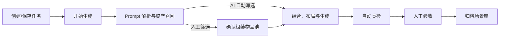
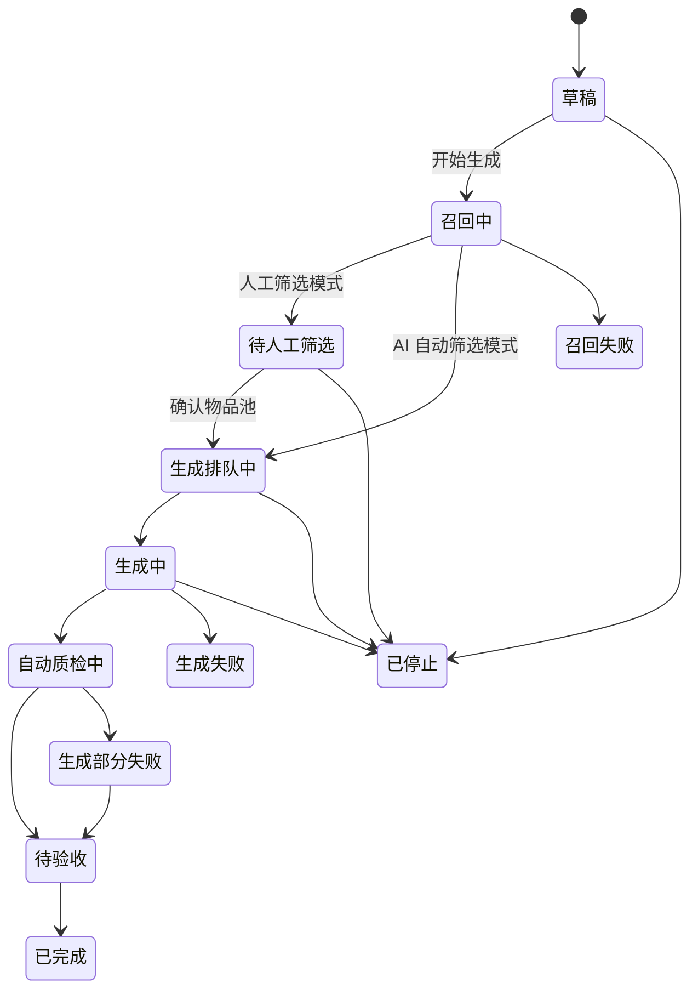

# Gen2Sim 场景自动组装 PRD（V1.8）

| 项目 | 内容 |
|---|---|
| 产品模块 | Gen2Sim - 场景生成任务 / 场景自动组装 |
| 版本 | V1.8 |
| 文档状态 | 原型同步版，待评审 |
| 目标用户 | 仿真建模师、合成数据生产人员、算法/评测工程师 |
| 对应原型 | `index.html`：任务列表、创建任务、环境选择、人工筛选弹框、任务详情与配置快照 |
| 更新日期 | 2026-09-16 |

---

## 1. 本次原型核对与需求变更

### 1.1 已落实至当前原型的内容

- 场景生成任务列表覆盖正常、人工介入、停止和失败等任务状态。
- 列表采用固定列宽，桌面端不出现横向滚动；操作列展示当前状态下的全部可用入口。
- 新建/编辑任务弹框底部固定为：`取消`、`保存`、`开始生成`；保存不等于开始生成。
- 空环境选择采用独立弹框，支持环境/场景页签、筛选入口、表格单选、分页与确认回填。
- 人工筛选以任务列表上的大尺寸弹框承载，不跳转页面。
- 人工筛选采用“左侧筛选 → 中间资产决策 → 右侧物品池实时结果”的连续工作台结构。
- 任务列表操作区的`任务详情`打开大尺寸详情弹框；弹框承载任务概览、配置快照、生成结果与验收、失败与运行记录，并以内容完整展示优先，内容超出时弹框内滚动。
- 已启动任务可查看任务配置快照；修改需求通过`克隆任务`创建新的任务 ID 解决，避免污染历史批次。人工筛选流程内的配置查看仅用于核对和返回筛选，不展示克隆入口。
- 配置快照不展示随机种子、规则版本。

### 1.2 原型中已发现但尚未真正实现的内容

- 筛选条件中的置信度、资产状态、资产分类仅展示，当前仅关键词搜索具备原型交互。
- 图文参考模式缺少“补充说明 Prompt”输入框；模板选择尚未写回 Prompt 编辑区。
- 环境选择器的“场景”页签仅展示入口，尚未接入数据和选择规则。
- 人工筛选弹框的资产详情、容量估算、碰撞预检查均为展示逻辑，尚未接入真实服务。
- 任务详情与配置快照当前为原型示例；基础信息会随点击的任务行回填，完整配置、阶段进度和结果记录仍待真实服务接入。
- 【⚠️0917更新】人工验收工作台已在原型中提供入口与交互：任务列表中`待验收`、`生成部分失败`任务可进入；默认打开大图验收视图，并可切换至场景池快速分流视图。验收、3D 漫游、归档仍为原型交互，未接入真实服务；任务列表不展示任何“查看…”类入口。

> 产品判断：原型应保持“交互意图先行”，但上述展示逻辑不能被视为后端能力已完成。研发排期需以本文的接口、状态和校验要求为准。

---

## 2. 产品定位、目标与边界

### 2.1 产品定位

Gen2Sim 是仿真平台内基于既有**空环境**和**资产库**的批量场景自动组装能力。用户以文本、图文或模板表达场景意图，系统完成资产召回、选品、布局、物理校验、批量产物生成和人工验收。

### 2.2 产品目标

1. 将“场景意图 → 可验收 USD 场景批次”的生产链路标准化。
2. 同时支持 AI 自动选品与人工确认资产池两类生产方式。
3. 对生成任务、环境、Prompt、资产和模型建立可追溯的配置快照。
4. 在生成前后暴露资产、布局、物理和质量风险，降低人工返工成本。

### 2.3 本期范围

- 空环境选择与版本锁定。
- Prompt 输入、改写、版本保留。
- 资产召回、人工筛选、组装物品池。
- 批量场景生成、USD 与固定机位图片输出。
- 自动质量检查、人工验收、归档入口。
- 任务列表、任务配置快照、克隆任务。

### 2.4 非本期范围

- 从零生成房屋结构、门窗、墙体或环境几何。
- 生成、修复底层 3D 资产。
- 多人实时协同编辑同一场景。
- 自动生成完整的机器人任务脚本。
- 多物理引擎间自动转换并保证结果一致。

---

## 3. 用户、核心场景与术语

| 角色 | 核心诉求 |
|---|---|
| 仿真建模师 | 快速生成布局合理、可微调的场景初稿 |
| 合成数据生产人员 | 批量生产、筛选、归档可用仿真数据 |
| 算法/评测工程师 | 获取具有清晰来源与可复现条件的训练/评测场景 |
| 验收人员 | 高效发现碰撞、穿模、风格和动线问题 |

| 术语 | 定义 |
|---|---|
| 空环境 | 没有预设可组装物体、可供资产摆放的环境资产 |
| 召回资产 | 根据 Prompt 与结构化场景设计从资产库返回的候选资产 |
| 组装物品池 | 当前任务经人工确认后可参与布局生成的资产集合 |
| 必需资产 | 每一个生成结果必须包含的资产或资产角色 |
| 候选资产 | 系统可按空间、类别与多样性规则抽取的资产 |
| 排除资产 | 当前任务不得参与生成的候选资产 |
| 克隆任务 | 复制当前任务的配置，创建具有新任务 ID 的可编辑任务 |

---

## 4. 业务流程与任务状态

### 4.1 核心业务流程



### 4.2 状态定义与入口

| 状态 | 含义 | 列表进度文案 | 全部操作入口 |
|---|---|---|---|
| 草稿 | 已保存配置，未触发生成 | 仅保存配置，尚未开始 | 编辑、删除草稿 |
| 召回中 | 正在解析 Prompt、检索资产 | 正在解析 Prompt 并召回资产 | 停止任务 |
| 待人工筛选 | 召回完成，等待确认物品池 | 召回完成，等待确认物品池 | 开始筛选、停止任务 |
| 生成排队中 | 已确认输入，等待计算资源 | 已排队，等待生成资源 | 停止任务 |
| 生成中 | 正在组合、布局、物理模拟和渲染 | 已生成数/目标数，正在布局与物理校验 | 停止任务 |
| 自动质检中 | 正在执行碰撞、可达性等检查 | 正在执行碰撞与可达性检查 | 停止任务 |
| 待验收 | 自动质检结束，等待人工结论 | 待人工验收 / 已验收数 | 进入验收 |
| 已完成 | 全部结果已处理 | 可用数 / 不可用数 | 克隆任务 |
| 已停止 | 用户主动停止，保留已有产物 | 用户已停止；结果已保留 | 克隆任务 |
| 召回失败 | Prompt 解析或资产召回失败 | 失败原因摘要 | 克隆任务 |
| 生成部分失败 | 已有可用生成结果，但部分结果失败 | 可用数 / 失败数 | 进入验收、克隆任务 |
| 生成失败 | 未产出可用结果 | 失败原因摘要 | 克隆任务 |

### 4.3 状态流转规则



> 规则：已启动任务的环境、Prompt、模型、过程模式和生成数量必须视为配置快照，不支持原地编辑。修改这些内容必须通过`克隆任务`产生新的任务 ID。

---

## 5. 功能需求

### 5.1 场景生成任务列表

#### 页面目标

让用户在一屏内了解任务所处阶段、生产进度、异常原因与下一步操作。

#### 字段

| 字段 | 规则 |
|---|---|
| 任务名称 / ID | 名称单行省略；下方展示唯一任务 ID |
| 空环境 | 展示环境名称、物理引擎、空间尺寸；名称过长省略 |
| 过程模式 | `AI 自动筛选` 或 `人工筛选` |
| 生成进度 | 一行内展示关键数值和阶段文案，下方展示进度条；不可换行 |
| 任务状态 | 使用颜色标签展示状态；颜色只辅助识别，必须保留文字 |
| 创建时间 | 展示相对或绝对创建时间 |
| 更新时间 | 展示最近一次配置保存、状态变化、进度变化或人工操作发生的时间 |
| 操作 | 根据状态展示全部可用的流程推进类文本入口；桌面端允许操作列最多两行，不允许横向滚动 |

#### 筛选与排序

- 搜索支持任务名称、任务 ID、环境名称。
- 状态筛选覆盖 12 个状态。
- 默认按最近更新时间倒序。
- 支持按更新时间切换：`最新优先`、`最早优先`。
- 重置清空所有筛选条件。

#### 交互规则

- `开始筛选`打开人工筛选大弹框，不跳转页面。
- `克隆任务`打开已预填原配置的新建任务弹框；保存或开始生成后创建新的任务 ID。
- `停止任务`必须二次确认，并说明“已生成结果将被保留”。
- `删除草稿`必须二次确认；仅草稿可删除。
- 列表不提供任何“查看…”类入口，包括查看进度、查看配置、查看结果和查看原因；仅保留流程推进操作。
- `进入验收`为已定义入口。【⚠️待补充页面】需补充验收页面原型；归档能力不在任务列表提供入口。

### 5.2 创建、保存与编辑任务

#### 字段

| 分组 | 字段 | 必填 | 规则 |
|---|---|---:|---|
| 基础信息 | 场景名称 | 是 | 1–50 字；不可为空或全空格；作为结果命名前缀 |
| 基础信息 | 场景描述 | 否 | 用于用途、验收重点、备注；不参与模型推理 |
| 环境 | 空环境 | 是 | 仅可选无预设物体、有效、用户有权限且与任务兼容的环境 |
| Prompt | 输入方式 | 是 | 纯文本 / 图文参考 / 导入提示词，三种互斥 |
| Prompt | 原始 Prompt | 是 | 描述空间、尺寸、门窗、必需物、风格、布局约束与禁忌项 |
| Prompt | AI 改写 Prompt | 否 | 改写不覆盖原文；原始、改写和最终生效版本均需保存 |
| 生成策略 | 生成数量 | 是 | 1–50 个场景 |
| 生成策略 | 场景生成模型 | 是 | 当前为 WWQW v1.8；保存模型版本快照 |
| 生成策略 | 过程模式 | 是 | AI 自动筛选 + 直接组装 / 人工筛选 + AI 随机组合 |

#### 底部操作

| 操作 | 规则 |
|---|---|
| 取消 | 未保存修改时二次确认：继续编辑 / 放弃修改 |
| 保存 | 仅保存当前配置为草稿，不触发召回或生成；至少要求任务名称【⚠️待确认】 |
| 开始生成 | 校验任务名称、环境、有效 Prompt、数量、过程模式；创建配置快照并进入下一流程 |

#### Prompt 规则

- AI 改写完成后，用户可以编辑改写版本、查看原文、还原原文、重新改写。
- 最终生效 Prompt 以用户提交时当前选中的版本为准。
- 【⚠️待技术确认】AI 改写应同时产出可编辑的“结构化摆放设计”：空间、门窗、必需资产、可选资产、布局约束、禁忌项。
- 图文模式必须同时上传参考图并填写“参考说明 Prompt”；图片用于视觉参考，文字用于明确空间、布局、风格和约束。
- 导入提示词模式仅提供文件选择上传，不展示预置模板卡片，也不展示“Prompt 改写与预览”。上传成功后提取文件文本作为本次任务的原始 Prompt。
- 原型支持选择 TXT、MD、DOCX，单文件不超过 10MB；TXT、MD 可由前端直接读取，DOCX 的解析由服务端完成。【⚠️待技术确认】需确定 DOCX 解析服务、扫描策略、文本抽取失败提示与是否支持更多格式（如 DOC、PDF）。
- 【⚠️待确认】导入后的 Prompt 是否允许进入文本编辑模式修改；建议本期只读保留原文件，需修改时切换至“纯文本”后编辑，避免文件原文与修改版本混淆。

### 5.3 空环境选择器

#### 功能

- 弹框标题：`选择场景或环境`。
- 支持环境/场景页签、筛选入口、环境表格、单选、分页、取消和确定。
- 表格字段：环境 ID、环境名称、排序、所属分类、缩略图、数据来源、适用物理引擎。
- 选择确定后回填名称、引擎、尺寸、版本和“空环境校验”状态。

#### 约束

- Gen2Sim V1.8 仅可选择空环境。
- 无权限、已删除、含预设物体、引擎不兼容的环境不可选择，并显示原因。
- 开始生成后环境 ID 与版本锁定。
- 【⚠️待确认】原型中的“场景”页签与“仅支持空环境”存在语义冲突。建议 V1.8 禁用该页签，或仅用于查看不可选场景并明确提示。

### 5.4 人工筛选与组装物品池

#### 触发与承载方式

- 仅适用于“人工筛选 + AI 随机组合”模式。
- 仅在任务状态为`待人工筛选`时可编辑。
- 从任务列表点击`开始筛选`打开大尺寸弹框，列表保留在遮罩下，不发生页面跳转。
- 弹框关闭、保存筛选后返回当前任务列表；确认物品池后任务状态进入`生成排队中`。

#### 页面结构

```text
左：筛选条件  |  中：召回资产（唯一决策区）  |  右：组装物品池（实时结果）
```

- 三栏不使用独立卡片边框；用两条浅色竖向分隔线表达连续工作台。
- 左侧负责过滤，中间负责勾选和资产角色设置，右侧只负责实时反馈与核对。
- 右侧不重复提供“必需/候选/排除”编辑控件，防止出现两个编辑源。

#### 左侧筛选条件

| 条件 | 规则 |
|---|---|
| 关键词 | 支持名称、资产 ID、标签搜索 |
| 置信度 | 高（≥80%）、中（50%–79%）、低（＜50%） |
| 资产状态 | 仅看已选、仅看风险资产 |
| 资产分类 | 家具、灯具、装饰/杂物等 |
| 重置 | 恢复默认筛选 |

> 【⚠️待技术确认】关键词、标签、分类和置信度的筛选需由资产检索服务提供一致字段；“风险资产”需要明确碰撞体缺失、尺寸异常、引擎不兼容等统一判定。

#### 中间召回资产区

每项资产展示：

- 勾选框、缩略图、资产名称、资产 ID、分类、尺寸。
- 匹配原因，例如：必需物品、尺寸适配、靠墙放置、风格匹配。
- 置信度标签。
- 资产角色下拉：`必需`、`候选`、`排除`。
- 风险文案，例如“建议排除：与场景语义不匹配”。

交互规则：

- 勾选资产默认加入候选池；用户可切换为必需或排除。
- 取消勾选即从必需/候选池移除。
- 被勾选行使用浅蓝背景和蓝色左标识线。
- 人工模式下，Prompt 明确要求的资产应默认给出“必需建议”。【⚠️待技术确认】需要 Prompt 结构化解析与资产角色映射。

#### 右侧组装物品池

- 分组展示必需、候选、排除资产及各组数量。
- 中间资产区的勾选/角色变化，实时更新右侧数量和资产列表；新增项使用轻量淡入反馈。
- 展示环境容量预估、基础组合是否满足、开始生成前的空间与碰撞预检查提示。
- 点击右侧资产应定位并高亮中间对应资产。【⚠️待补充交互】

#### 底部操作与校验

| 操作 | 规则 |
|---|---|
| 保存筛选 | 保存当前物品池，任务保持`待人工筛选` |
| 确认物品池并开始生成 | 校验通过后固化资产 ID、版本、角色和筛选结果，状态变为`生成排队中` |

确认校验：

- 至少选择 1 个必需资产和 1 个候选资产。
- Prompt 中的必需资产类别均有覆盖。【⚠️待技术确认】需定义“类别覆盖”和“替代资产”的规则。
- 资产池不为空。
- 环境容量明显超限、资产缺少碰撞体或引擎不兼容时给出风险提示。【⚠️待确认】风险是阻断还是允许用户确认后继续。

### 5.5 任务详情弹框

#### 入口与通用规则

- 每条任务在操作区提供`任务详情`，打开大尺寸详情弹框，不跳转页面；点击遮罩、关闭按钮或返回任务列表可关闭。
- 弹框内容按任务状态动态回填，包含任务概览、配置快照、生成结果与验收、失败与运行记录四个页签。
- 弹框优先完整展示内容，超出可视区域时仅弹框内容区滚动；不得透传点击至底层任务列表。
- 【⚠️待技术确认】详情数据采用一次聚合接口还是“任务基础信息 + 进度 / 结果 / 日志”分接口加载。建议基础信息优先返回，结果与日志按页签懒加载。
- 【⚠️0917更新】当任务状态为`待验收`或`生成部分失败`时，“生成结果与验收”页签应展示验收摘要及`进入人工验收`入口；该入口打开独立全屏验收工作台，默认进入大图验收视图，不在详情弹框内堆叠验收图片与操作。

#### 状态与详情展示映射

| 任务状态 | 当前阶段 / 任务概览 | 生成结果与验收 | 失败与运行记录 |
|---|---|---|---|
| 草稿 | 配置草稿；提示可继续编辑 | 未生成结果 | 无运行记录 |
| 召回中 | 资产召回；展示召回进度与当前处理说明 | 等待召回完成 | 召回服务运行状态 |
| 待人工筛选 | 人工确认物品池；提供开始筛选 | 尚未生成 | 等待人工处理 |
| 生成排队中 | 等待生成资源 | 尚未生成 | 队列状态 / 等待说明 |
| 生成中 | 批量生成；展示已完成数 / 目标数 | 生成进行中 | 运行状态与逐场景异常 |
| 自动质检中 | 自动质量检查 | 质检进行中 | 质检运行状态与不通过项 |
| 待验收 | 等待人工验收；提供进入验收 | 结果待验收 | 运行完成、等待验收结论 |
| 已完成 | 任务完成 | 可用 / 不可用结果及验收结论 | 历史运行记录 |
| 已停止 | 用户停止，保留已生成产物 | 已保留结果 | 停止时间、停止阶段、已生成数量 |
| 召回失败 | 召回失败 | 无生成结果 | 失败阶段、用户可读原因、错误码、重试建议 |
| 生成部分失败 | 部分结果可用 | 可用结果与失败样本分组 | 失败场景、失败阶段、错误码、重试粒度 |
| 生成失败 | 未生成可用结果 | 无生成结果 | 失败阶段、用户可读原因、错误码、重试建议 |

> 规则：详情弹框的状态、进度摘要、结果摘要和日志摘要必须来自同一任务状态版本，避免轮询刷新时出现“状态已完成但结果仍为空”的不一致展示。【⚠️待技术确认】建议接口返回 `task_version` 或事件序号供前端判定。

### 5.6 任务配置快照与克隆任务

#### 配置快照

人工筛选弹框内的`查看配置`打开轻量配置快照弹框，仅供核对；关闭或点击`返回筛选`后回到原筛选上下文，不展示克隆任务。任务列表操作区的`任务详情`打开详情弹框，详情页的`配置快照`页签为所有状态统一承载配置查看的主入口；当前列表不提供任何“查看…”类操作入口。配置快照展示：

- 任务名称、任务 ID、创建人、创建时间。
- 空环境、环境 ID、物理引擎、空间尺寸。
- 最终生效 Prompt、参考输入类型。
- 过程模式、场景生成模型、生成数量。
- 当前状态、召回结果数量、物品池确认状态。

不展示：随机种子、规则版本。

#### 克隆任务

- 已启动或结束任务不可原地编辑。
- 克隆入口不出现在人工筛选、生成排队、生成中和自动质检中等执行流程；仅在终态/异常任务提供，任务详情页为推荐主入口，列表可保留同等入口以满足高频批量操作，避免将“分支新建”混入“推进当前任务”的工作流。
- 点击`克隆任务`后，以当前环境、Prompt、模型、数量、过程模式预填创建弹框。
- 保存或开始生成后生成新的任务 ID。
- 克隆任务不得复用原任务的运行结果、物品池确认结果或验收结果。
- 【⚠️待确认】克隆是否默认携带参考图片与上传文件；建议需要用户显式确认，避免权限和文件失效问题。

### 5.7 批量生成、质检、验收与归档

#### 批量生成

1. 从必需/候选物品池采样资产。
2. 按空间约束放置大件、功能件、小件和装饰物。
3. 执行碰撞消解、落地、物理静置。
4. 生成 USD 和固定机位图片。
5. 对失败项按策略重试。

#### 自动质检

| 检查项 | 最低要求 |
|---|---|
| 碰撞 / 穿模 | 关键资产和环境不得存在硬碰撞 |
| 落地 / 支撑 | 可移动资产应具有合理支撑面 |
| 物理稳定性 | 静置后不得持续滑移、倒塌、穿透 |
| 边界 / 门窗 | 不得越出环境边界或遮挡门窗、出口 |
| 可达性 | 至少保留主要通行路径【⚠️待确认阈值】 |
| Prompt 命中 | 必需物品、数量和禁忌项满足要求 |
| 多样性 | 同批场景不可为近重复【⚠️待确认判定方法】 |

#### 产物与验收

- 每个成功场景输出 USD 文件和不少于 10 张固定机位图片。
- 【⚠️待确认】是否输出深度图、语义/实例分割、2D/3D Box、相机内外参等训练数据标注。
- 人工验收支持可用、不可用和 3D 漫游。
- 不可用必须选择原因：穿模/碰撞、物理不稳定、动线不可用、必需物品缺失、风格不符、资产质量异常、任务不符、其他。
- 可用结果可归档进入场景库，并保留来源任务和配置快照。
- 人工验收为独立全屏工作台，由任务列表中状态为`待验收`或`生成部分失败`任务的`进入验收`进入。
- 【⚠️0917更新】验收工作台提供`大图验收视图`和`场景池视图（快速分流）`；入口默认选中大图验收视图，两个视图切换入口位于任务信息右侧，并与验收统计、关闭入口同一区域。
- 【⚠️0917更新】大图验收视图是默认主工作模式：仅展示当前待验收场景，按当前筛选、搜索和排序条件形成验收队列；默认风险优先。用户完成`标记可用`或`标记不可用`后，结果即时提交并自动推进至下一条待验收场景；不得按时间自动轮播或自动切换，避免打断空间判断。
- 【⚠️0917更新】大图验收场景区顶部展示队列位置、Scene ID / 名称、自动质检摘要、人工验收状态、生成时间、资产数、USD 状态、物理引擎与`进入 3D 漫游`入口。场景区依次展示五个关键视角、质量信息与人工验收信息，底部固定为本场景的`标记不可用`、`标记可用`操作，不与页面级归档按钮混淆。
- 每个大图场景展示 5 个同等重要、可独立切换视角的关键图片位置。默认视角为左前 45°、右后 45°、顶视图、平面图、入口视图；每个位置可切换至操作区、正前 / 后、左 / 右侧、左后 / 右前 45°、仰视 / 支撑检查等补充视角。默认五个位置不得重复；用户可因排查需要手动重复选择。平面图需展示环境边界、门窗、资产占地框与风险位置。【⚠️待技术确认】视角图片的生成、命名规范与缺失视角兜底。
- 【⚠️0917更新】场景池视图用于快速浏览和分流，桌面端以一行 2 个场景模块、多行纵向排列展示 20 个场景，不允许横向滚动。每个模块仅使用统一的平面图缩略图（缺失时降级为顶视图），展示 Scene ID / 名称、自动质检、人工验收状态、资产数、USD、引擎、紧凑质量摘要与快速`标记可用`、`标记不可用`、`大图验收`入口；不重复展示五图和完整质检证据。
- 【⚠️0917更新】场景池中的`标记不可用`采用卡片内两步操作：先展开不可用原因多选，再确认提交；避免在未填写原因时误提交。已验收场景只展示基础信息、质量摘要和验收结论，允许进入大图视图复核，并保留历史验收记录。
- 质量信息与人工验收位于五图下方，横向并列展示；质量信息包含碰撞 / 穿模、落地 / 支撑、可达性、必需资产覆盖、Prompt 命中和多样性风险。
- 人工验收仅保留`标记可用`、`标记不可用`两个提交操作，不设置额外保存按钮；标记不可用必须至少勾选一个不可用原因，支持多选并可填写备注。
- 自动质检存在风险时，人工标记可用必须二次确认；标记不可用必须选择不可用原因。
- 批量标记可用仅适用于自动质检全部通过且无风险项的场景；首期不开放批量标记不可用。
- 仅人工验收为可用的场景可归档；归档入口位于验收工作台，不回流至任务列表。
- 【⚠️待补充页面】3D 漫游页、归档确认弹框、场景库归档结果页。

---

## 6. 数据对象与接口需求

### 6.1 任务核心字段

```text
task_id, task_name, description, creator, created_at, updated_at,
status, process_mode, quantity, generated_count, usable_count, unusable_count,
environment_id, environment_version, physics_engine, environment_size,
raw_prompt, rewritten_prompt, effective_prompt, prompt_input_mode,
reference_image_ids, imported_prompt_file_id, imported_prompt_file_name, imported_prompt_text, model_version,
recall_asset_count, asset_pool_snapshot, failure_code, failure_message
```

### 6.2 资产核心字段

```text
asset_id, asset_version, name, category, tags, thumbnail_url,
dimensions, orientation, physics_engine_compatibility,
collision_status, physical_material_status, support_surface,
semantic_score, match_reasons, risk_flags, pool_role
```

### 6.3 场景验收对象【⚠️0917更新】

```text
scene_id, task_id, scene_name, generated_at, updated_at, usd_status,
asset_count, physics_engine, manual_acceptance_status,
auto_quality_status, auto_quality_score, auto_quality_risk_count,
collision_result, support_result, reachability_result, required_asset_coverage,
prompt_match_score, diversity_risk, quality_evidence[],
rendered_view_urls{left_front_45,right_rear_45,top,plan,entry,...},
plan_view_status, review_reasons[], review_note, reviewer, reviewed_at,
review_version, review_lock_owner, review_lock_expire_at
```

- `rendered_view_urls`至少支持大图验收默认五图与补充视角；平面图缺失时，场景池视图使用顶视图降级，并显式标识缺失。
- `manual_acceptance_status`取值为`待验收`、`可用`、`不可用`；已验收结论必须关联`reviewer`、`reviewed_at`、`review_version`。
- 【⚠️待技术确认】多人验收下需返回`review_lock_*`或等价的乐观锁版本，避免两个验收人覆盖同一 Scene 的结论。

### 6.3 接口与异步要求

- 创建、保存草稿、开始生成、停止、克隆、确认物品池均需返回任务 ID 和最新状态。
- 生成进度需支持轮询或事件推送。【⚠️待技术确认】推荐使用任务事件流，避免高频轮询。
- 列表、配置快照、召回资产、物品池、质量报告均需按任务 ID 查询。
- 失败返回需包含用户可读失败文案和可用于研发排查的错误码。
- 【⚠️0917更新】人工验收接口需支持：按任务查询场景池及筛选/排序、按 Scene 查询五图与质检证据、提交可用/不可用结论、获取下一条待验收场景、读取验收历史。`提交结论`应返回最新场景状态、统计计数和下一候选 Scene，避免前端分别请求后产生队列与统计不一致。

---

## 7. 技术卡点与责任落点

| 编号 | 卡点 | 发生流程 | 主要协作方 |
|---|---|---|---|
| T1 | 资产尺寸、轴向、碰撞体、材质、标签、版本完整性 | 环境选择、资产召回、人工筛选 | 资产平台、仿真研发 |
| T2 | PhysX / Newton 资产兼容性与质检一致性 | 生成、自动质检 | 仿真研发 |
| T3 | Prompt 到结构化摆放设计的协议和置信度 | Prompt 解析、资产召回 | 算法、后端、产品 |
| T4 | LLM 规划、规则/约束求解、物理验证的布局路线 | 批量布局生成 | 算法、仿真研发 |
| T5 | 不同具身任务的可达性和动线阈值 | 自动质检 | 算法、评测、仿真研发 |
| T6 | 批量生成、物理静置、多机位渲染的时延、队列、取消和重试 | 生成、产物输出 | 平台后端、渲染/仿真研发 |
| T7 | 场景多样性与近重复判定 | 自动质检 | 算法、评测 |
| T8 | USD、纹理与资产依赖的打包、版本锁定、历史复现 | 归档、场景库 | 资产平台、仿真研发 |
| T9 | 参考图片的授权、保存周期、模型使用边界 | 图文 Prompt | 平台、法务/安全【⚠️待确认责任方】 |
| T10 | 未召回资产能否加入物品池 | 人工筛选 | 产品、资产平台 |
| T11 | “场景”页签与“仅选空环境”的边界 | 环境选择 | 产品、环境资产平台 |
| T12【⚠️0917更新】 | 五个默认验收视角、补充视角、平面图及风险证据的稳定渲染与命名规范 | 生成产物、自动质检、人工验收 | 渲染/仿真研发、算法 |
| T13【⚠️0917更新】 | 场景池统一平面图、布局相似/近重复判断的可解释性；平面图缺失的顶视图降级 | 自动质检、人工验收 | 算法、评测、渲染/仿真研发 |
| T14【⚠️0917更新】 | 多人并发验收、结论提交幂等、队列自动推进与统计实时一致性 | 人工验收、归档 | 平台后端、产品 |

---

## 8. 指标与验收标准

### 8.1 产品指标【⚠️待确认目标值】

- 任务创建成功率。
- Prompt 解析成功率、资产召回成功率。
- 人工筛选任务的物品池确认率。
- 批量生成成功率、单场景自动质检通过率。
- 人工验收可用率、单场景平均验收时长。
- 场景重试率、失败原因分布。
- 克隆任务后的再次生成成功率。

### 8.2 功能验收

- 用户可保存草稿，且保存不会触发任务运行。
- 用户可开始生成，系统按过程模式进入正确状态。
- 列表可在无横向滚动的前提下展示任务字段与全部可用入口。
- 人工筛选仅可从`待人工筛选`任务进入，且以弹框形式打开。
- 中间资产选择和角色切换可实时同步至右侧物品池。
- 物品池不满足最低校验时不可确认生成。
- 已启动任务不可编辑配置；克隆任务必须产生新任务 ID。
- 每个已生成结果可关联环境、Prompt、模型、资产池和质检结论。
- 【⚠️0917更新】从列表进入验收时默认打开大图验收视图；场景池视图只能由任务信息右侧的视图切换入口主动切换。
- 【⚠️0917更新】大图验收提交结论后，系统只自动推进至下一条待验收场景；不允许以定时轮播方式切换场景。
- 【⚠️0917更新】场景池视图桌面端一行两卡且无横向滚动；平面图缺失时必须有顶视图降级和可见提示。
- 【⚠️0917更新】不可用结论无原因不得提交；自动质检风险场景的可用结论必须经过二次确认，提交结果、验收计数及下一条队列场景必须保持同一版本。

---

## 9. 待补充素材清单

- 【⚠️待补充图片】环境选择器中真实环境缩略图与不可选状态示例。
- 【⚠️待补充图片】Prompt 图文参考上传、预览、删除和失败态。
- 【⚠️待补充图片】任务进度详情页。
- 【⚠️待补充图片】人工验收页、3D 漫游页、失败原因页。
- 【⚠️待补充图片】场景库归档及场景详情页。

---

## 10. 产品风险与建议

1. **“全部操作可见”与列表密度存在天然张力。** 当前按确认方案展示全部文本入口，操作列允许两行；若后续操作继续增长，必须重新引入“更多”或转为任务详情页承载，否则桌面端仍会挤压关键生产信息。
2. **人工筛选弹框适合当前 126 项级别的操作。** 若单次召回达到数百或数千项、需要频繁查看资产 3D 详情，建议升级为全屏工作台，而非无限扩展弹框。
3. **“场景”页签必须先定义产品语义。** 允许直接选已有场景会违反空环境组装边界；在规则未确定前不应开放选择。
4. **资产元数据质量决定产品上限。** 在没有可靠尺寸、碰撞体和引擎兼容信息的前提下，任何 AI 选品、容量预估和自动质检都会出现不可解释失败。
